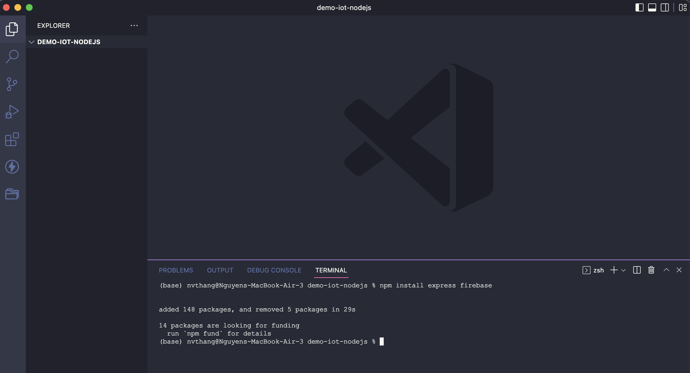
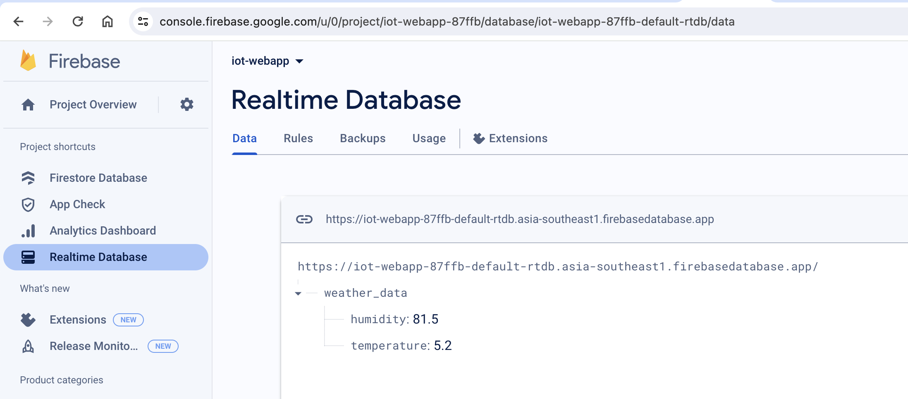
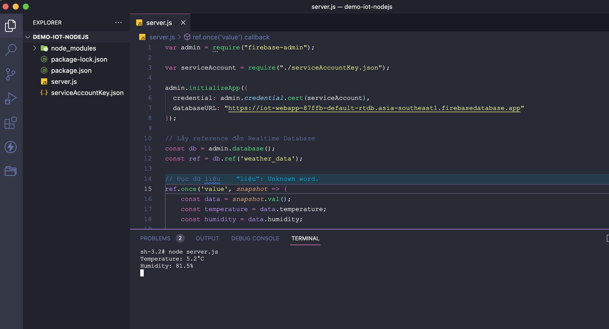
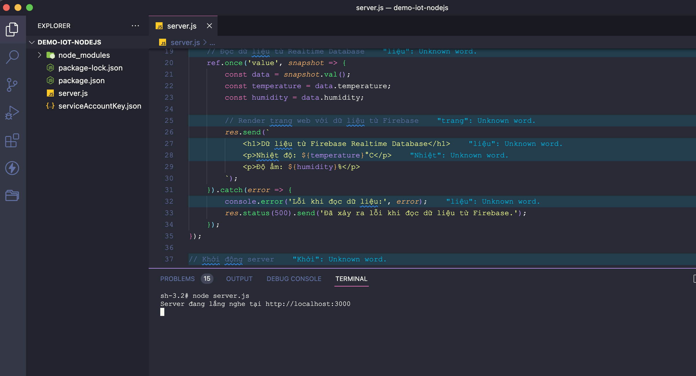
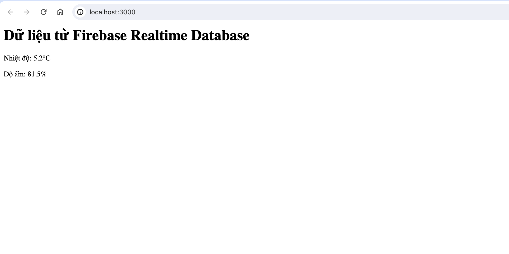

# Hướng dẫn thực hiện kết nối Nodejs và Firebase

## Bước 1: Thiết lập thư mục dự án

Đầu tiên, cần tạo một thư mục, ví dụ `node-firebase`, đây sẽ là thư mục làm việc cho dự án của chúng ta.

Tiếp sau đó, mở thư mục này trên VS code bằng cách kéo thư mục vào phần mềm VS code hoặc chuột phải vào thư mục và chọn `Open with Code`.

## Bước 2: Thiết lập các packages cần thiết

Mở Terminal trên VS Code và chạy các câu lệnh sau

```nodejs
npm init -y
npm install firebase-admin
npm install express firebase
```



## Bước 3: Tải tệp cấu hình Service Account
1. Đăng nhập vào Firebase Console tại https://console.firebase.google.com/.
2. Tạo một dự án mới hoặc sử dụng dự án đã tồn tại.
3. Trong cài đặt dự án Firebase của bạn, chọn "Service accounts" trong mục "Project settings".
4. Tạo một tệp Service Account bằng cách nhấp vào nút "Generate new private key".
5. Lưu tệp JSON được tạo xuống thư mục dự án của bạn.


## Bước 4: Tạo web Node.js và Express

Đầu tiên chúng ta cần quan sát, dữ liệu được lưu trên firebase realtime DB với cấu trúc như sau:



Tiếp theo, tạo một file `server.js` trong thư mục của dự án và thêm mã sau:

```js
var admin = require("firebase-admin");

var serviceAccount = require("./serviceAccountKey.json") // thay đường dẫn đến tệp Service Account đã tải xuống ở bước 3;

admin.initializeApp({
  credential: admin.credential.cert(serviceAccount),
  databaseURL: "YOUR_DB_URL" // thay thế URL DB
});

// Lấy reference đến Realtime Database
const db = admin.database();
const ref = db.ref('weather_data');

// Đọc dữ liệu
ref.once('value', snapshot => {
    const data = snapshot.val();
    const temperature = data.temperature;
    const humidity = data.humidity;

    console.log(`Temperature: ${temperature}°C`);
    console.log(`Humidity: ${humidity}%`);
}).catch(error => {
    console.error('Lỗi khi đọc dữ liệu:', error);
});
```
Chạy Project bằng câu lệnh `node server.js` trên terminal:



## Bước 5: Tạo dạo diện hiển thị cho website
Ở bước trên chúng ta đã lấy được dữ liệu trên firebase và hiển thị trên Terminal. Ở bước này chúng ta sẽ chỉnh sửa lại code để hiển thị dữ liệu lên một trang web bằng gói Express.

Chỉnh sửa lại file `server.js` như sau

```js
var admin = require("firebase-admin");
const express = require('express');
var serviceAccount = require("./serviceAccountKey.json");

const app = express();


admin.initializeApp({
  credential: admin.credential.cert(serviceAccount),
  databaseURL: "https://iot-webapp-87ffb-default-rtdb.asia-southeast1.firebasedatabase.app"
});

// Lấy reference đến Realtime Database
const db = admin.database();
const ref = db.ref('weather_data');

// Route để hiển thị dữ liệu trên trang web
app.get('/', (req, res) => {
    // Đọc dữ liệu từ Realtime Database
    ref.once('value', snapshot => {
        const data = snapshot.val();
        const temperature = data.temperature;
        const humidity = data.humidity;

        // Render trang web với dữ liệu từ Firebase
        res.send(`
            <h1>Dữ liệu từ Firebase Realtime Database</h1>
            <p>Nhiệt độ: ${temperature}°C</p>
            <p>Độ ẩm: ${humidity}%</p>
        `);
    }).catch(error => {
        console.error('Lỗi khi đọc dữ liệu:', error);
        res.status(500).send('Đã xảy ra lỗi khi đọc dữ liệu từ Firebase.');
    });
});

// Khởi động server
const port = 3000;
app.listen(port, () => {
    console.log(`Server đang lắng nghe tại http://localhost:${port}`);
});

```
Chạy lại project bằng câu lệnh `node server.js`



Truy cập website bằng địa chỉ được hiển thị trên terminal ta được kết quả như sau: 

